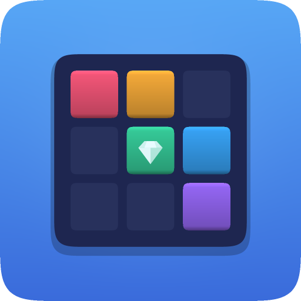
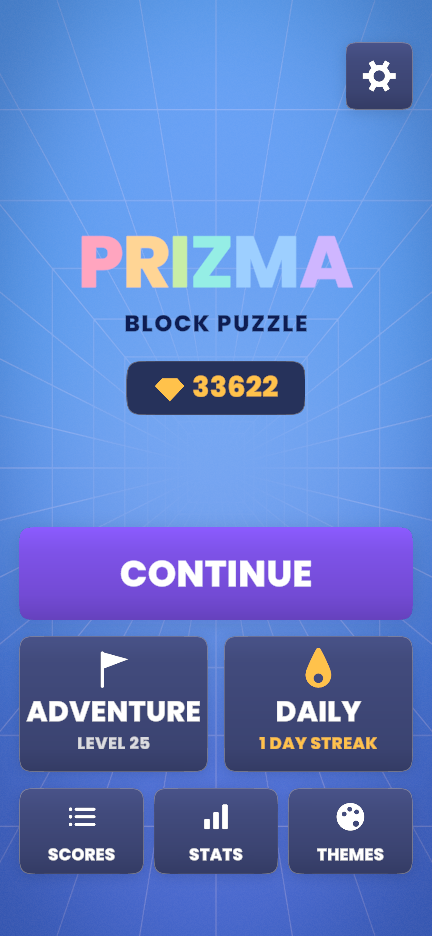
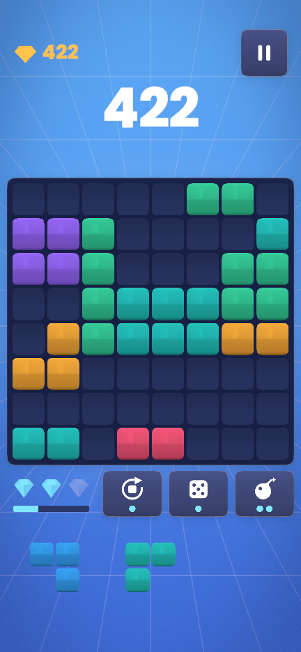
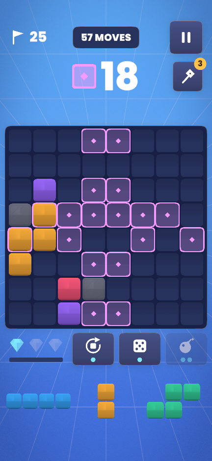
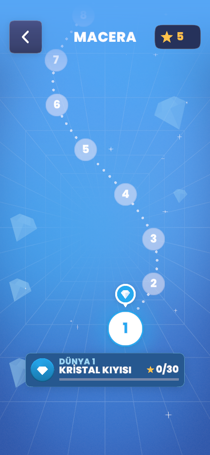
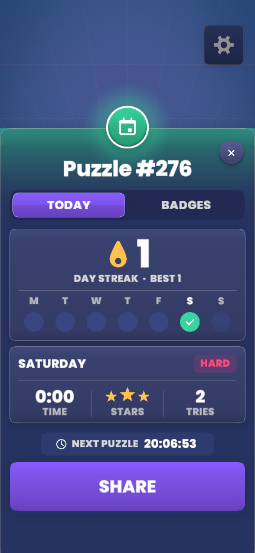

<p align="center">
  
</p>

<h1 align="center">PRIZMA</h1>

<p align="center">
  <b>A block puzzle with prism powers.</b><br>
  8×8 board · three modes · 100 adventure levels · a new puzzle every day
</p>

<p align="center">
  Unity 6 · URP · Android · portrait · Turkish &amp; English
</p>

<p align="center">
  
  
  
  
  
</p>

---

## What it is

Drag pieces onto the board, fill rows and columns, clear them. PRIZMA keeps the instant readability of the genre
and adds what it usually lacks:

- **Prism powers, earned by playing.** Clearing lines charges the prism. Charges buy **Rotate** (turn a piece in the
  tray), **Reroll** (deal the rest again) and **Bomb** (clear a 3×3 area). When nothing fits but a charge is left,
  the run waits for you to decide instead of ending.
- **A fair dealer.** Blind random dealing hands out dead trays without warning. PRIZMA plays each candidate tray
  through like a competent player before dealing — but only when you need it, and in waves, so the help is felt and
  never seen.
- **Three modes.**
  - **Classic** — endless, for the high score.
  - **Adventure** — 100 levels across 10 worlds on a winding map. Each world brings something new: crystals,
    glow tiles, stone, spreading shade, colour orders, timer blocks, double ice. Hard levels are marked, boosters and
    win streaks are earned, world chests wait at the end of each world.
  - **Daily** — one puzzle a day, the same for everyone, playable only today. Streaks, badges, a shareable result
    and an optional reminder.
- **The room changes colour as you play.** Score milestones, combos and single-colour lines shift the light of the
  whole screen — progress you read from the room, not from text.
- **Themes** unlocked with stars, achievements, saved runs in every mode, colour-blind mode, haptics.

No accounts, no ads, no in-app purchases, no data collected.

## Everything is code

There is no art or audio in the project. Blocks, panels, shadows, icons and the app icon are drawn at startup by a
small software rasteriser (`Raster`); every sound effect and the music are synthesised (`SoundSynth`). The only
imported asset is the [Poppins](https://fonts.google.com/specimen/Poppins) font (SIL OFL 1.1). The scene contains a
single object — `GameRoot` with `AppController` — and the whole interface is built from code.

## Getting started

**Requirements:** Unity **6000.6.0f1** with *Android Build Support* (SDK, NDK and OpenJDK modules).

1. Clone the repository and open the folder in Unity Hub.
2. Open `Assets/Scenes/SampleScene.unity` and press **Play**. Set the Game view to a portrait size (e.g. 1080×1920).

## Project structure

```
Assets/
├── Scripts/Core/        pure game logic — no UnityEngine; board, dealer, sessions, level generator, bot
├── Scripts/Game/        presentation — screens, widgets, rasteriser, audio synthesis, themes, localisation
├── Editor/              release build, build checks, app icon generator, Android settings
├── Resources/Lang/      one JSON file per language (tr.json, en.json)
├── Resources/Shaders/   the backdrop shader
├── Resources/Fonts/     TMP font assets (Poppins)
└── Plugins/Android/     daily reminder (AlarmManager + notification), no third-party plugins
Builds/                  release builds, one folder per version (not in git)
Docs/                    release readiness, privacy policy, reference analysis
Tools/                   Unity-free test and measurement tools
```

## Building a release

In the Editor: **PRIZMA → Android Yayın Build'i (AAB + APK)**. With the Editor closed:

```
Unity -batchmode -quit -projectPath <project> -buildTarget Android \
      -executeMethod BlockPuzzle.EditorTools.ReleaseBuild.BuildAndroid
```

Each version gets its own folder, and the newest good build is marked active:

```
Builds/
├── 1.0.0/                 an earlier release
└── 1.1.0-active/          the current one
    ├── PRIZMA-1.1.0.aab   upload this to Google Play
    ├── PRIZMA-1.1.0.apk   the same bundle as one APK, to install on a phone
    └── build-report.txt   what was checked and how it came out
```

- **Version name** follows semantic versioning (`MAJOR.MINOR.PATCH`) and is set in *Player Settings → Version*.
  The **version code** counts up by itself.
- **Signing** uses an upload key kept outside the repository, in `%USERPROFILE%\.prizma\`
  (`prizma-upload.jks` + `signing.json` with `alias`, `storePass`, `keyPass`). Never commit it; keep a backup.
- After every build the APK is opened and **checked**: target API level, the permission allow-list, a release
  signature, 16 KB page alignment, and that no development package made it into the player. A build that fails a
  check is deleted and the reason is written to its report.

## Tools

| Tool | Purpose |
|---|---|
| `Tools/CoreHarness` | Builds the core logic without Unity: rule tests, balance simulation, level difficulty curve, dealer cost |
| `Tools/AudioCheck` | Measures every synthesised clip; writes WAV sequences with the game's real timing for listening |
| `Tools/compile-check.ps1` | Compiles game and editor code with Unity's own compiler arguments |
| `Tools/autotest.ps1` | Builds a test player, walks through every screen and saves a screenshot of each |
| `Tools/theme-check.py` | Contrast and colour-distance rules for every theme |
| `Tools/lang-check.py` | Checks each language file against English: keys, placeholders, font coverage |

```
<Unity>/Editor/Data/DotNetSdk/dotnet.exe build Tools/CoreHarness -c Release
dotnet Tools/CoreHarness/bin/Release/net8.0/Harness.dll tests
```

## Adding a language

Copy `Assets/Resources/Lang/en.json` to `<code>.json` (e.g. `de.json`), translate the values, fill in `_name`
(the language's name in itself) and `_culture` (e.g. `de-DE`), then run `python Tools/lang-check.py`. No code
changes are needed. Poppins covers Latin scripts (Western and Central European, Turkish, Indonesian); Cyrillic,
Greek, CJK, Arabic, Thai and Vietnamese need a fallback font named in `_font`.

## Documentation

- [`CLAUDE.md`](CLAUDE.md) — the full engineering notes: rules, systems, measurements and the decisions behind them (Turkish)
- [`Docs/ReleaseReadiness.md`](Docs/ReleaseReadiness.md) — what stands between the project and Google Play
- [`Docs/PrivacyPolicy.html`](Docs/PrivacyPolicy.html) — privacy policy (Turkish & English)

## Status

Feature complete and preparing for a closed test on Google Play. Next: testing on real devices, the store listing,
and more languages.

## License

No license has been chosen for the source code yet, so all rights are reserved by default.
The Poppins font is licensed under the [SIL Open Font License 1.1](Assets/Fonts/OFL.txt).
